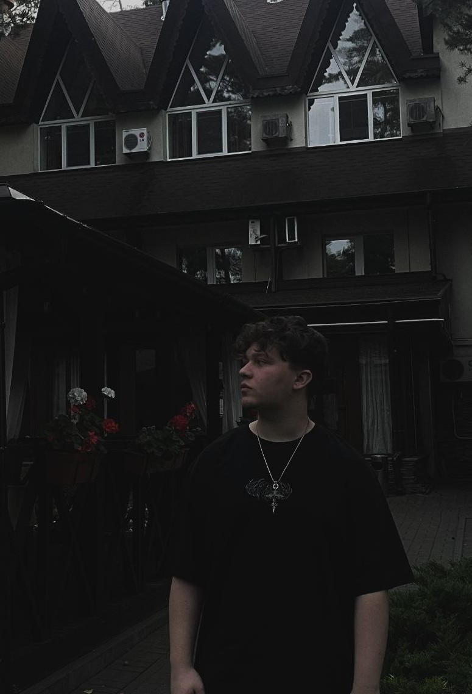

<!DOCTYPE html>
<html lang="en" class="scroll-smooth">
<head>
    <meta charset="UTF-8">
    <meta name="viewport" content="width=device-width, initial-scale=1.0, maximum-scale=1.0, user-scalable=no">
    <title>EMEREX | Motion & Graphic Design</title>
    
    <link href="https://cdnjs.cloudflare.com/ajax/libs/font-awesome/6.4.0/css/all.min.css" rel="stylesheet">
    <link href="https://fonts.googleapis.com/css2?family=Plus+Jakarta+Sans:wght@300;400;500;600;700;800&display=swap" rel="stylesheet">
    
    
</head>
<body class="antialiased">

    <!-- КАСТОМНЫЙ КУРСОР ЭЛЕМЕНТЫ -->
    

    

    <!-- ЧАСТИЦЫ НА ФОНЕ (ИСКРЫ) -->
    <canvas id="particles-bg" class="fixed inset-0 w-full h-full z-[-2] pointer-events-none"></canvas>

    <!-- VIDEO PLAYER MODAL -->
    

        <button id="video-close" class="absolute top-4 right-4 md:top-8 md:right-8 w-12 h-12 bg-white/10 hover:bg-white/20 rounded-full flex items-center justify-center text-white transition z-50">
            <i class="fa-solid fa-xmark text-xl"></i>
        </button>
        

            <!-- iframe будет вставляться сюда через JS -->
            <iframe id="youtube-iframe" class="absolute top-0 left-0 w-full h-full" src="" frameborder="0" allow="accelerometer; autoplay; clipboard-write; encrypted-media; gyroscope; picture-in-picture; web-share" allowfullscreen></iframe>
        

    

    <!-- MEGA Retention Graph Modal Overlay -->
    

        

            <button id="retention-close" class="absolute top-4 right-4 w-10 h-10 bg-white/5 hover:bg-white/10 rounded-full flex items-center justify-center text-white/50 hover:text-white transition z-50">
                <i class="fa-solid fa-xmark"></i>
            </button>
            
            

                

                    <h3 class="text-3xl md:text-4xl font-bold text-white mb-2 flex items-center gap-3" data-i18n="modal_retention_title">
                        Views Growth <i class="fa-solid fa-fire text-primary text-2xl"></i>
                    </h3>
                    

                        Stop getting 0 views. With high-end editing and dynamic pacing, your content will hook the audience and trigger the algorithm.
                    

                

                

                    

                        Avg. View Duration
                        03:45 <i class="fa-solid fa-arrow-trend-up"></i>
                    

                    

                        Click-Through Rate
                        14.2% <i class="fa-solid fa-arrow-trend-up"></i>
                    

                

            

            
            <!-- Animated Graph Container -->
            

                
                

                    1M+
                    500K
                    100K
                    10K
                    0
                

                

                    #1
                    #2
                    #3
                    #4
                    Viral 🚀
                

                

                    

                        

                        

                        

                        

                        

                    

                    

                        

                        

                        

                        

                        

                    

                    
                    

                        <i class="fa-solid fa-crown text-[#ffd700]"></i> Algorithm Boost
                    

                    
                    <svg class="w-full h-full absolute inset-0 z-10 overflow-visible" preserveAspectRatio="none" viewBox="0 0 100 100">
                        <defs>
                            <linearGradient id="grad" x1="0" y1="0" x2="0" y2="1">
                                <stop offset="0%" stop-color="#ff1a1a" stop-opacity="0.5"/>
                                <stop offset="100%" stop-color="#ff1a1a" stop-opacity="0.0"/>
                            </linearGradient>
                        </defs>
                        <path id="graph-fill" d="M0,100 L0,95 C40,95 60,85 75,60 C85,40 95,15 100,5 L100,100 Z" fill="url(#grad)" class="opacity-0 transition-opacity duration-1000 delay-300"/>
                        <path id="graph-line" d="M0,95 C40,95 60,85 75,60 C85,40 95,15 100,5" fill="none" stroke="#ff1a1a" stroke-width="3" class="path-anim drop-shadow-[0_0_8px_rgba(255,26,26,0.8)]"/>
                    </svg>
                    
                    

                

            

            
            <button id="retention-contact-btn" class="w-full mt-8 bg-primary hover:bg-primaryHover text-white px-6 py-4 rounded-xl font-bold transition-all text-sm md:text-base flex items-center justify-center gap-2 shadow-[0_0_20px_rgba(255,26,26,0.4)] hover:shadow-[0_0_30px_rgba(255,26,26,0.6)] group">
                <i class="fa-brands fa-telegram text-xl group-hover:scale-110 transition-transform"></i> Start a Project & Boost Views
            </button>
        

    

    <!-- Header / Navbar -->
    <header class="fixed top-4 md:top-6 inset-x-0 w-full z-50 px-4 md:px-6 pointer-events-none">
        

            <!-- Logo -->
            <a href="#" class="flex items-center gap-1.5 md:gap-2 text-base md:text-xl font-bold tracking-tight bg-black/50 backdrop-blur-md px-3 py-1.5 md:px-4 md:py-2 rounded-full border border-white/10 shrink-0">
                

                EMEREX
            </a>
            
            <!-- Center Nav Pill -->
            <nav id="main-nav" class="hidden lg:flex items-center gap-1 bg-[#111]/80 backdrop-blur-md px-2 py-1.5 rounded-full border border-white/10 relative">
                

                
                <a href="#home" class="nav-link px-5 py-2 text-white text-sm font-medium transition active-tab" data-i18n="nav_home">Home</a>
                <a href="#portfolio" class="nav-link px-5 py-2 text-gray-400 hover:text-white text-sm font-medium transition" data-i18n="nav_works">Works</a>
                <a href="#about" class="nav-link px-5 py-2 text-gray-400 hover:text-white text-sm font-medium transition" data-i18n="nav_about">About</a>
                <a href="#testimonials" class="nav-link px-5 py-2 text-gray-400 hover:text-white text-sm font-medium transition" data-i18n="nav_reviews">Reviews</a>
            </nav>

            <!-- Language Switcher & Contact -->
            

                <!-- Lang Toggle -->
                

                    <button class="lang-btn px-2 py-1 text-[10px] md:text-xs font-bold rounded-full text-white bg-white/10 transition" data-lang="en">EN</button>
                    <button class="lang-btn px-2 py-1 text-[10px] md:text-xs font-bold rounded-full text-gray-500 hover:text-white transition" data-lang="ru">RU</button>
                    <button class="lang-btn px-2 py-1 text-[10px] md:text-xs font-bold rounded-full text-gray-500 hover:text-white transition" data-lang="uk">UA</button>
                

                <a href="https://t.me/em3rex" target="_blank" class="flex items-center gap-1.5 md:gap-2 bg-[#111]/80 hover:bg-primary backdrop-blur-md px-3 py-1.5 md:px-5 md:py-2 rounded-full border border-white/10 text-[10px] md:text-sm font-medium transition-all group shrink-0">
                    Contact <i class="fa-brands fa-telegram text-gray-400 group-hover:text-white transition text-[12px] md:text-base"></i>
                </a>
            

        

    </header>

    <!-- HERO SECTION -->
    <section id="home" class="pt-28 md:pt-32 pb-10 px-4 md:px-6 relative w-full overflow-hidden">
        <!-- КРАСНАЯ СФЕРА -->
        

        

            

                
                <!-- Main Title Block (Left) -->
                

                    

                    
                    

                    <!-- YouTube Interface Mockup -->
                    

                        

                            <i class="fa-brands fa-youtube text-primary text-2xl"></i>
                            

                            

                                

                                

                            

                        

                        

                            

                                

                                    
<i class="fa-solid fa-play text-white text-[10px] ml-0.5"></i>

                                

                                

                                

                            

                            

                                

                                    
<i class="fa-solid fa-play text-white/40 text-[10px] ml-0.5"></i>

                                

                                

                                

                            

                            

                                

                                    
<i class="fa-solid fa-play text-white/40 text-[10px] ml-0.5"></i>

                                

                                

                                

                            

                            

                                

                                    
<i class="fa-solid fa-play text-white/40 text-[10px] ml-0.5"></i>

                                

                                

                                

                            

                        

                    

                    

                    

                    

                    <!-- Main Hero Text Content -->
                    

                        

                            

                                <i class="fa-solid fa-bolt text-primary"></i> Available for worldwide projects
                            

                            <h1 class="text-4xl sm:text-5xl md:text-7xl font-bold tracking-tighter leading-[1.1] mb-4" data-i18n="hero_title">
                                Your Visuals  
                                On Demand
                            </h1>
                            

                                From discovery to deployment, I craft motion graphics and design experiences that audiences actually love.
                            

                        

                        

                            <a href="#portfolio" class="bg-primary hover:bg-primaryHover text-white px-6 md:px-8 py-3 md:py-3.5 rounded-full font-semibold transition-colors text-xs md:text-sm" data-i18n="btn_works">
                                Explore Works
                            </a>
                            <a href="https://t.me/em3rex" class="bg-transparent border border-white/20 hover:border-white text-white px-6 md:px-8 py-3 md:py-3.5 rounded-full font-semibold transition-all text-xs md:text-sm" data-i18n="btn_start">
                                Start a Project
                            </a>
                        

                    

                

                <!-- Right Info Grid -->
                

                    

                        

                            40+
                            Clients
                        

                        

                            <!-- ИЗМЕНЕНО: 3M+ -->
                            3M+
                            Views Gen.
                        

                    

                    

                        

                        

                            <h4 class="text-lg md:text-xl font-bold text-white mb-1 group-hover:text-primary transition-colors" data-i18n="stat_retention_title">High Retention</h4>
                            
Algorithm-friendly pacing

                        

                        

                            <i class="fa-solid fa-chart-line text-lg md:text-xl"></i>
                        

                    

                    

                        

                            4+
                            Years Exp
                        

                        

                            100+
                            Projects
                        

                    

                

            

            <!-- Skills Banner (Бегущая строка) -->
            

                

                    <!-- Block 1 -->
                    

                        After Effects•
                        Premiere Pro•
                        Photoshop•
                        Blender 3D•
                        Motion Design•
                        Graphic Art•
                        YouTube Turnkey•
                    

                    <!-- Block 2 -->
                    

                        After Effects•
                        Premiere Pro•
                        Photoshop•
                        Blender 3D•
                        Motion Design•
                        Graphic Art•
                        YouTube Turnkey•
                    

                    <!-- Block 3 -->
                    

                        After Effects•
                        Premiere Pro•
                        Photoshop•
                        Blender 3D•
                        Motion Design•
                        Graphic Art•
                        YouTube Turnkey•
                    

                

            

        

    </section>

    <!-- PORTFOLIO SECTION -->
    <section id="portfolio" class="py-16 md:py-20 px-4 md:px-6 relative overflow-hidden">
        <!-- КРАСНАЯ СФЕРА -->
        

        

            

                

                    

                        

 Works
                    

                    <h2 class="text-3xl sm:text-4xl md:text-5xl font-bold tracking-tight" data-i18n="title_works">Selected Projects</h2>
                

                
A curated showcase of recent motion graphics, branding, and digital design. Click to enlarge.

            

            <!-- Portfolio Filters -->
            

                <button class="filter-btn px-4 md:px-5 py-1.5 md:py-2 rounded-full border border-white/10 bg-white/10 text-white text-xs md:text-sm font-medium transition" data-filter="all" data-i18n="filt_all">All</button>
                <button class="filter-btn px-4 md:px-5 py-1.5 md:py-2 rounded-full border border-white/10 bg-transparent text-gray-400 hover:text-white hover:bg-white/5 text-xs md:text-sm font-medium transition" data-filter="podcasts" data-i18n="filt_podcasts">Podcasts</button>
                <button class="filter-btn px-4 md:px-5 py-1.5 md:py-2 rounded-full border border-white/10 bg-transparent text-gray-400 hover:text-white hover:bg-white/5 text-xs md:text-sm font-medium transition" data-filter="gaming" data-i18n="filt_gaming">YouTube Gaming</button>
                <button class="filter-btn px-4 md:px-5 py-1.5 md:py-2 rounded-full border border-white/10 bg-transparent text-gray-400 hover:text-white hover:bg-white/5 text-xs md:text-sm font-medium transition" data-filter="vlogs" data-i18n="filt_vlogs">Vlogs</button>
                <button class="filter-btn px-4 md:px-5 py-1.5 md:py-2 rounded-full border border-white/10 bg-transparent text-gray-400 hover:text-white hover:bg-white/5 text-xs md:text-sm font-medium transition" data-filter="reels" data-i18n="filt_reels">Reels / TikToks</button>
                <button class="filter-btn px-4 md:px-5 py-1.5 md:py-2 rounded-full border border-white/10 bg-transparent text-gray-400 hover:text-white hover:bg-white/5 text-xs md:text-sm font-medium transition" data-filter="creatives" data-i18n="filt_creatives">Creatives</button>
            

            

                
                

                    
                    

                        

                            <i class="fa-solid fa-play text-white text-2xl md:text-3xl ml-1"></i>
                        

                    

                    

                        YouTube Gaming
                        <h3 class="text-lg md:text-2xl font-bold mb-1 md:mb-2" data-i18n="port_game_t">Insane Gaming Montage</h3>
                        
High-energy edit with crazy pacing and sound design.

                    

                

                

                    
                    

                        

                            <i class="fa-solid fa-play text-white text-2xl md:text-3xl ml-1"></i>
                        

                    

                    

                        Opium Style
                        <h3 class="text-lg md:text-2xl font-bold mb-1 md:mb-2" data-i18n="port_opium_t">Opium Style Promo</h3>
                        
Trendy, dark aesthetics with heavy sync.

                    

                

                

                    
                    

                        

                            <i class="fa-solid fa-play text-white text-2xl md:text-3xl ml-1"></i>
                        

                    

                    

                        Vlogs
                        <h3 class="text-lg md:text-2xl font-bold mb-1 md:mb-2" data-i18n="port_vlog1_t">Cinematic Vlog</h3>
                        
Smooth storytelling and color grading.

                    

                

                

                    
                    

                        

                            <i class="fa-solid fa-play text-white text-2xl md:text-3xl ml-1"></i>
                        

                    

                    

                        Vlogs
                        <h3 class="text-lg md:text-2xl font-bold mb-1 md:mb-2" data-i18n="port_vlog2_t">Dynamic Lifestyle Vlog</h3>
                        
Engaging pacing designed for high retention.

                    

                

                

                    
                    

                        

                            <i class="fa-solid fa-play text-white text-2xl md:text-3xl ml-1"></i>
                        

                    

                    

                        Podcast
                        <h3 class="text-lg md:text-2xl font-bold mb-1 md:mb-2" data-i18n="port_podcast_t">Podcast Edit</h3>
                        
Clean cuts, multi-camera sync, and dynamic pop-ups.

                    

                

                

                    
                    

                        

                            <i class="fa-solid fa-play text-white text-2xl md:text-3xl ml-1"></i>
                        

                    

                    

                        YouTube Gaming
                        <h3 class="text-lg md:text-2xl font-bold mb-1 md:mb-2" data-i18n="port_game_new_t">New Gaming Highlights</h3>
                        
Fresh gameplay edit with epic moments.

                    

                

                

                    
                    

                        

                            <i class="fa-solid fa-play text-white text-2xl md:text-3xl ml-1"></i>
                        

                    

                    

                        Vlogs
                        <h3 class="text-lg md:text-2xl font-bold mb-1 md:mb-2" data-i18n="port_vlog_new_t">Latest Cinematic Vlog</h3>
                        
New journey, new vibes, new edit.

                    

                

                <!-- 8. ИИ контент (Шортс) -->
                

                    
                    

                        

                            <i class="fa-solid fa-play text-white text-2xl md:text-3xl ml-1"></i>
                        

                    

                    

                        Reels / TikToks
                        <h3 class="text-lg md:text-2xl font-bold mb-1 md:mb-2" data-i18n="port_short_ai_t">AI Content Edit</h3>
                        
Dynamic captions and visual effects for AI-generated content.

                    

                

                <!-- 9. Тик Ток -->
                

                    
                    

                        

                            <i class="fa-solid fa-play text-white text-2xl md:text-3xl ml-1"></i>
                        

                    

                    

                        Reels / TikToks
                        <h3 class="text-lg md:text-2xl font-bold mb-1 md:mb-2" data-i18n="port_short_tiktok_t">Viral TikTok</h3>
                        
High-retention short form video with trendy edits.

                    

                

                <!-- 10. Анимация логотипа -->
                

                    
                    

                        

                            <i class="fa-solid fa-play text-white text-2xl md:text-3xl ml-1"></i>
                        

                    

                    

                        Creatives
                        <h3 class="text-lg md:text-2xl font-bold mb-1 md:mb-2" data-i18n="port_creative_logo_t">Logo Animation</h3>
                        
Clean and professional logo reveal animation.

                    

                

                <!-- 11. Стерильный монтаж 1 -->
                

                    
                    

                        

                            <i class="fa-solid fa-play text-white text-2xl md:text-3xl ml-1"></i>
                        

                    

                    

                        Reels / TikToks
                        <h3 class="text-lg md:text-2xl font-bold mb-1 md:mb-2" data-i18n="port_short_sterile1_t">Clean Short Edit</h3>
                        
Minimalistic and clean edit for professional shorts.

                    

                

                <!-- 12. Стерильный монтаж 2 -->
                

                    
                    

                        

                            <i class="fa-solid fa-play text-white text-2xl md:text-3xl ml-1"></i>
                        

                    

                    

                        Reels / TikToks
                        <h3 class="text-lg md:text-2xl font-bold mb-1 md:mb-2" data-i18n="port_short_sterile2_t">Expert Short Form</h3>
                        
Sterile video editing focused on clear delivery.

                    

                

            

            <!-- КНОПКА ПОКАЗАТЬ ЕЩЕ -->
            

                <button id="load-more-btn" class="flex flex-col items-center gap-2 text-gray-400 hover:text-white transition group">
                    Show More
                    

                        <i class="fa-solid fa-chevron-down group-hover:translate-y-0.5 transition-transform" id="load-more-icon"></i>
                    

                </button>
            

        

    </section>

    <!-- ABOUT / SERVICES -->
    <section id="about" class="py-16 md:py-20 px-4 md:px-6 relative overflow-hidden">
        <!-- КРАСНАЯ СФЕРА -->
        

        

            
            

                

 Experience & Services
            

            <h2 class="text-4xl md:text-5xl font-bold tracking-tight mb-10" data-i18n="title_about">My Journey</h2>

            

                
                

                    

                        
                        

                            <h3 class="text-4xl md:text-5xl font-bold text-white mb-2" data-i18n="profile_name">EMEREX</h3>
                            
Motion & Graphic Designer

                            

                                <i class="fa-solid fa-briefcase"></i> In industry since 2022
                            

                        

                    

                    

                        

                        

                            

                                <i class="fa-solid fa-fire text-sm md:text-base"></i>
                            

                            

                                

                                    2025 — 2026 

                                

                                <h4 class="text-lg md:text-xl font-bold text-white mb-2" data-i18n="exp_3_title">Creatives Production — EuroAFF</h4>
                                
Producing high-converting creative assets and ad videos. Managing visual concepts from scratch to final render.

                            

                        

                        

                            

                                <i class="fa-solid fa-heart-pulse text-sm md:text-base"></i>
                            

                            

                                
2024 — 2025

                                <h4 class="text-lg md:text-xl font-bold text-white mb-2" data-i18n="exp_2_title">Motion Designer — Medical Edition</h4>
                                
Created premium motion graphics and visual identity for medical projects. Focused on clean, trustworthy design.

                            

                        

                        

                            

                                <i class="fa-solid fa-gamepad text-sm md:text-base"></i>
                            

                            

                                
2022 — 2024

                                <h4 class="text-lg md:text-xl font-bold text-white mb-2" data-i18n="exp_1_title">Gaming Content Editing</h4>
                                
Edited high-retention content for gaming channels. Mastered dynamic pacing, sound design, and viral storytelling.

                            

                        

                    

                

                

                    

                        <i class="fa-brands fa-youtube"></i>
                    

                    

                        

                            

                                <i class="fa-solid fa-play"></i>
                            

                            <h3 class="text-xl font-bold" data-i18n="yt_title">YouTube & Socials Turnkey</h3>
                        

                        

                            Full production packaging: from high-energy gaming edits to trendy 'Opium' style. I create high-CTR thumbnails and edit dynamic projects designed to hack the algorithm.
                        

                    

                    

                        #Turnkey
                        #Thumbnails
                        #OpiumStyle
                    

                

                

                    

                        <i class="fa-brands fa-tiktok"></i>
                    

                    

                        

                            

                                <i class="fa-solid fa-mobile-screen"></i>
                            

                            <h3 class="text-xl font-bold" data-i18n="shorts_title">Viral Shorts & TikToks</h3>
                        

                        

                            High-energy pacing, viral sound design, and interactive captions built to skyrocket your social media presence on Reels, Shorts, and TikTok.
                        

                    

                    

                        #Reels
                        #TikTok
                        #ViralPacing
                    

                

                

                    

                        <i class="fa-solid fa-rectangle-ad"></i>
                    

                    

                        

                            

                                <i class="fa-solid fa-bullhorn"></i>
                            

                            <h3 class="text-xl font-bold" data-i18n="creatives_title">Ad Creatives</h3>
                        

                        

                            Stunning promotional creatives designed to convert. Custom concepts made specifically to scale your SaaS, e-commerce, or affiliate marketing offers.
                        

                    

                    

                        #AdCreatives
                        #EuroAFF
                        #ROI-Focused
                    

                

            

        

    </section>

    <!-- TESTIMONIALS -->
    <section id="testimonials" class="py-16 md:py-20 px-4 md:px-6 relative overflow-hidden">
        <!-- КРАСНАЯ СФЕРА -->
        

        

            

                

                    

                        <i class="fa-solid fa-star"></i> Reviews <i class="fa-solid fa-star"></i>
                    

                    <h2 class="text-3xl sm:text-4xl md:text-5xl font-bold tracking-tight" data-i18n="title_reviews">Client Feedback</h2>
                

                <a href="https://t.me/+GYFDVUDuTxs0YmEy" target="_blank" class="bg-primary/10 hover:bg-primary border border-primary/20 hover:border-primary text-primary hover:text-white px-6 py-3 rounded-full font-bold transition-all text-xs md:text-sm flex items-center gap-2 group">
                    More in Telegram <i class="fa-brands fa-telegram text-lg group-hover:scale-110 transition-transform"></i>
                </a>
            

            

                
                <!-- 1. Опиум стайл (5 звезд) -->
                

                    
<i class="fa-solid fa-star"></i><i class="fa-solid fa-star"></i><i class="fa-solid fa-star"></i><i class="fa-solid fa-star"></i><i class="fa-solid fa-star"></i>

                    
"Броу смог помочь с сочнейшим опиумным стилем, немного от приступа флексии глаза болели, но такому дрипсу позавидывал бы даже карти"

                    

                        
DN

                        

                            <h4 class="text-sm font-bold text-white">Dan N.</h4>
                            
Music Artist

                        

                    

                

                <!-- 2. Вставки и детали (4 звезды) -->
                

                    
<i class="fa-solid fa-star"></i><i class="fa-solid fa-star"></i><i class="fa-solid fa-star"></i><i class="fa-solid fa-star"></i><i class="fa-regular fa-star"></i>

                    
"Вставки очень хорошо выглядят, очень хорошее внимание к деталям, так что могу смело рекомендовать"

                    

                        
AR

                        

                            <h4 class="text-sm font-bold text-white">Anton R.</h4>
                            
YouTuber

                        

                    

                

                <!-- 3. Свежо и вовремя (5 звезд) -->
                

                    
<i class="fa-solid fa-star"></i><i class="fa-solid fa-star"></i><i class="fa-solid fa-star"></i><i class="fa-solid fa-star"></i><i class="fa-solid fa-star"></i>

                    
"Все вовремя, качество хорошее и визуал выглядит свежо"

                    

                        
VS

                        

                            <h4 class="text-sm font-bold text-white">Vlad S.</h4>
                            
Entrepreneur

                        

                    

                

            

        

    </section>

    <!-- FOOTER -->
    <footer class="py-8 border-t border-white/5 text-center text-xs md:text-sm text-gray-600">
        
© 2026 EMEREX. All rights reserved.

    </footer>

    <!-- Interactive Scripts -->
    
</body>
</html>
